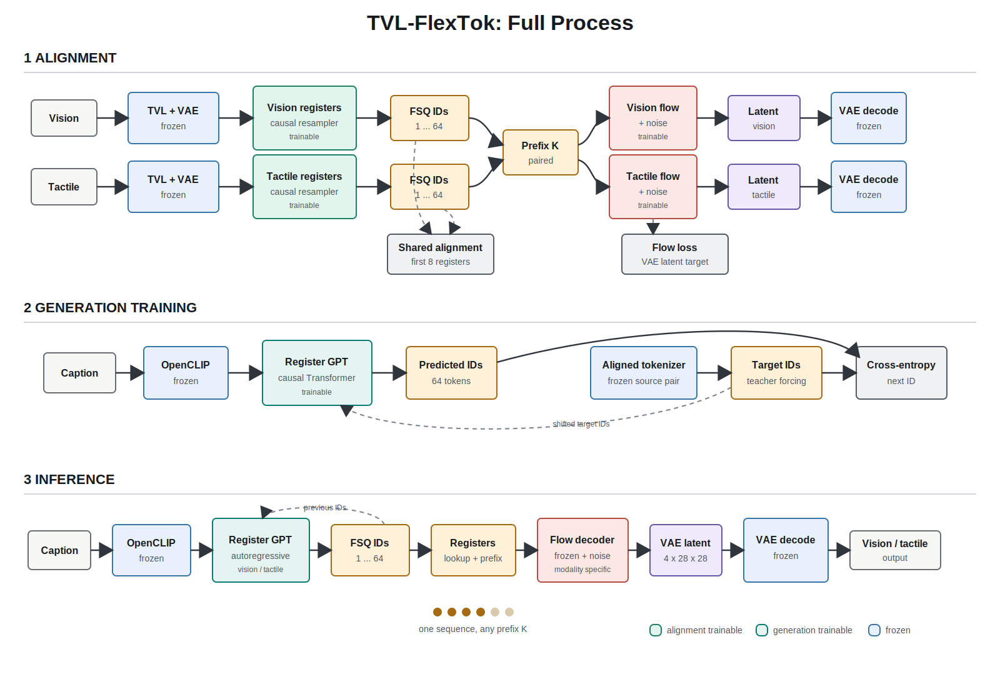

# TVL-FlexTok

TVL-FlexTok compresses paired vision and tactile inputs into ordered,
FSQ-discrete register sequences. Its training contract follows FlexTok:

[Full process SVG](docs/figures/tvl_flextok_full_process.svg) |
[Full process PNG](docs/figures/tvl_flextok_full_process.png) |
[Alignment diagram](docs/figures/tvl_flextok_alignment_stage.svg) |
[Generation diagram](docs/figures/tvl_flextok_generation_stage.svg)



```text
Alignment:  image/tactile -> frozen VAE + frozen TVL -> causal registers -> FSQ
                                               registers -> rectified flow -> VAE latent

Generation: text -> frozen OpenCLIP text tokens -> shared causal GPT -> FSQ IDs
                                               FSQ IDs -> register lookup -> rectified flow -> VAE latent
                                               VAE latent -> frozen VAE decoder -> image
```

## Alignment Stage

`--stage alignment` jointly trains the modality-specific causal register
resamplers, FSQ projections, shared-register alignment heads, and separate
vision/tactile rectified-flow decoders. TVL and the FlexTok VAE are frozen.

The loss is:

```text
contrastive_weight * quantized_shared_register_contrastive
+ continuous_contrastive_weight * pre_FSQ_shared_register_contrastive
+ diversity_weight * pre_FSQ_anti_collapse
+ reconstruction_weight * mean(vision_flow_matching, tactile_flow_matching)
```

Every sample independently draws a prefix length uniformly from `1..R`; the
paired vision and tactile inputs use the same length. Dropped registers are
masked in flow cross-attention. A learned null condition supports conditioning
dropout and classifier-free guidance. Frozen-TVL feature preservation is not
optimized because the registers are intended to discard irrelevant detail.

## Generation Stage

`--stage generation` freezes the aligned tokenizer, flow decoders, VAE, and
TVL/OpenCLIP encoders. One modality-conditioned causal Transformer predicts
the complete sequence of discrete FSQ IDs from contextual OpenCLIP text
tokens. It predicts exactly `R` IDs; there is no EOS class. During training,
teacher forcing right-shifts target IDs so position zero receives a
modality-specific BOS and position `i` receives target ID `i-1`. During
inference, each generated ID is fed back before predicting the next one. A
causal mask prevents access to future IDs.

Generated IDs are converted through the frozen FSQ lookup into continuous
register embeddings. Those registers, not the IDs and not the VAE decoder,
condition the frozen modality flow decoder. The flow decoder maps noise to a
VAE latent; only that latent enters the frozen VAE decoder. One generated
sequence can be truncated to any prefix length before flow decoding.

This stage does not autoregress continuous VAE patches. The former latent-patch
objective was removed because it was not the FlexTok second stage and its low
teacher-forced NLL did not produce valid free-running reconstructions.

## Diagnostics

Alignment writes source-conditioned exact reconstructions to
`reconstructions/`. Generation writes two distinct products:

- `reconstructions/`: targets, frozen-VAE round trips, and flow outputs from
  ground-truth tokenizer registers.
- `generations/`: free-running text-to-register outputs at configured prefix
  lengths.

JSON diagnostics report per-image PSNR/SSIM, prefix curves, VAE ceilings,
token accuracy/perplexity, and shuffled-text conditioning gaps. Best compact
checkpoints and visual artifacts are archived under
`tvl_flextok/logs/runs/<name>/`; full optimizer resume state is periodically
written as `checkpoint_latest.pth` under `/scratch/$USER/tvl_flextok/`.

Generation panels must be produced with the current autoregressive loop. Job
`9420033` trained a valid checkpoint, but its in-process panels predate the
off-by-one inference fix and are not quality evidence. Corrected job `9420298`
rendered the archived checkpoint under
`logs/runs/flextok_canonical_generation_overfit8_reg64/corrected_visualization/`.
Use `visualize_generation.py` or the `generation_vis` Slurm target for future
checkpoints.

## Commands

```bash
python tvl_flextok/test_modules.py

# One-GPU, full SSVTP+HCT alignment with 64 registers by default.
tvl_flextok/scripts/submit_slurm.sh alignment

# Train text-conditioned register generation from a corrected alignment model.
tvl_flextok/scripts/submit_slurm.sh generation \
  ALIGNMENT_CKPT=/path/to/checkpoint_best_joint.pth

# Render a completed generation checkpoint with the current inference code.
tvl_flextok/scripts/submit_slurm.sh generation_vis \
  GENERATION_CKPT=/path/to/checkpoint_best_generation.pth
```

Both entrypoint forms are supported:

```bash
python tvl_flextok/train.py --help
python -m tvl_flextok.train --help
```

FSQ defaults to `[8,8,8,5,5,5]` (64,000 IDs). `*_code_ids` is the stable
discrete interface; `*_all_tokens_full` contains its projected continuous
embeddings for flow conditioning. See
[EXPERIMENT_STATUS.md](EXPERIMENT_STATUS.md) for run provenance and
[MULTIMODAL_FUSION_MODEL_AUDIT.md](MULTIMODAL_FUSION_MODEL_AUDIT.md) for the
model audit and LLM/VLA integration discussion.
